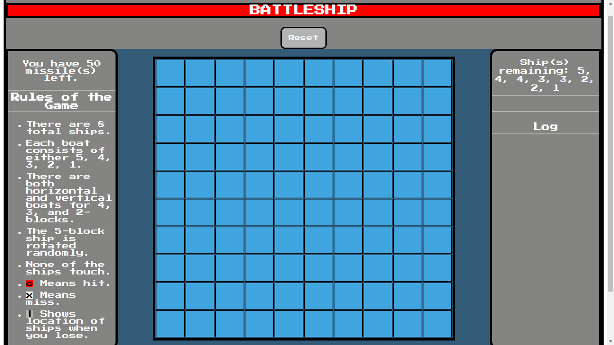

# Battleship

# Description

Battleship is a single-player game where the objective is to sink all of the ships before missile supply runs out!

## Rules of the Game:

- There are 8 total ships
- Each board consists of one 5-block ship, two 4-block ships, two 3-block ships, two 2-block ships, and one 1-block ship
- For the 4, 3, and 2-block ships, each ship is oriented horizontally and vertically
- The 5-block ship is oriented randomly
- None of the ships are within a block of each other horizontally, vertically, or diagonally
- Each player is afforded 50 missiles

## Code

### Languages/Libraries

- JavaScript
- jQuery
- HTML
- CSS

### model.js

Contains functions that deal with game logic.

### controller.js

Contains functions that change the visual game board based on user interactions.
